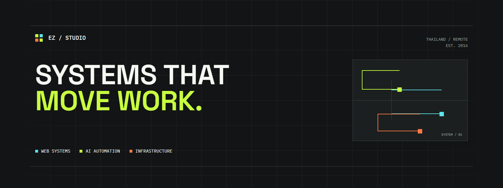
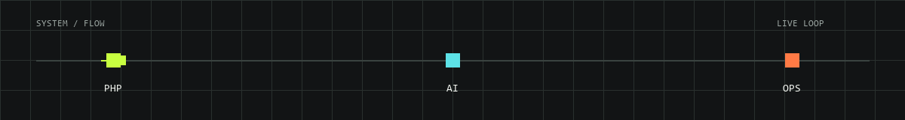

  

  

  
  
  

<h1 align="center">EZ Studio</h1>

  เราสร้างระบบ PHP, AI automation และ infrastructure 
  ที่ช่วยให้ทีมทำงานน้อยลง แต่เดินหน้าได้มากขึ้น

---

## What we build

| Focus | What it means |
| --- | --- |
| **PHP web systems** | ระบบหลังบ้าน, API, เว็บไซต์ธุรกิจ และ web applications ที่ต่อยอดได้ |
| **AI automation** | Workflow, bot และ AI integrations ที่ตัดงานซ้ำของทีมออกไป |
| **Infrastructure** | Deployment, Docker, Cloudflare, VPS และระบบที่พร้อมใช้งานต่อเนื่อง |

## Selected systems

งาน production ส่วนใหญ่เป็น private client work จึงสรุปเป็นประเภทระบบโดยไม่เปิดเผยข้อมูลของลูกค้า

<table>
  <tr>
    <td width="33%" valign="top">
      <strong>PHP Platforms</strong>  
      Business backends, APIs, dashboards และระบบจัดการข้อมูล  
      <code>PHP</code> <code>API</code> <code>MySQL</code>
    </td>
    <td width="33%" valign="top">
      <strong>Automation Engines</strong>  
      Workflow orchestration, bots และการเชื่อม AI เข้ากับงานประจำ  
      <code>AI</code> <code>Workflow</code> <code>Integration</code>
    </td>
    <td width="33%" valign="top">
      <strong>Deployment Systems</strong>  
      ระบบ deploy, container และ infrastructure สำหรับงานที่ต้องทำงานต่อเนื่อง  
      <code>Docker</code> <code>Linux</code> <code>Cloudflare</code>
    </td>
  </tr>
</table>

## How we work

เริ่มจากการทำความเข้าใจงานที่ต้องการให้ไหลลื่นขึ้น แล้วออกแบบระบบที่เชื่อมคน ข้อมูล และเครื่องมือเข้าด้วยกันอย่างพอดี

**Think clearly. Build practically. Improve continuously.**

## Technology

  

## Live status

  
  

`NOW` Building PHP systems · Connecting AI workflows · Shipping reliable infrastructure

## Contribution flow

<picture>
  <source media="(prefers-color-scheme: dark)" srcset="./assets/github-contribution-grid-snake-dark.svg" />
  <source media="(prefers-color-scheme: light)" srcset="./assets/github-contribution-grid-snake.svg" />
  
</picture>

---

Built in Thailand. Working remotely.

